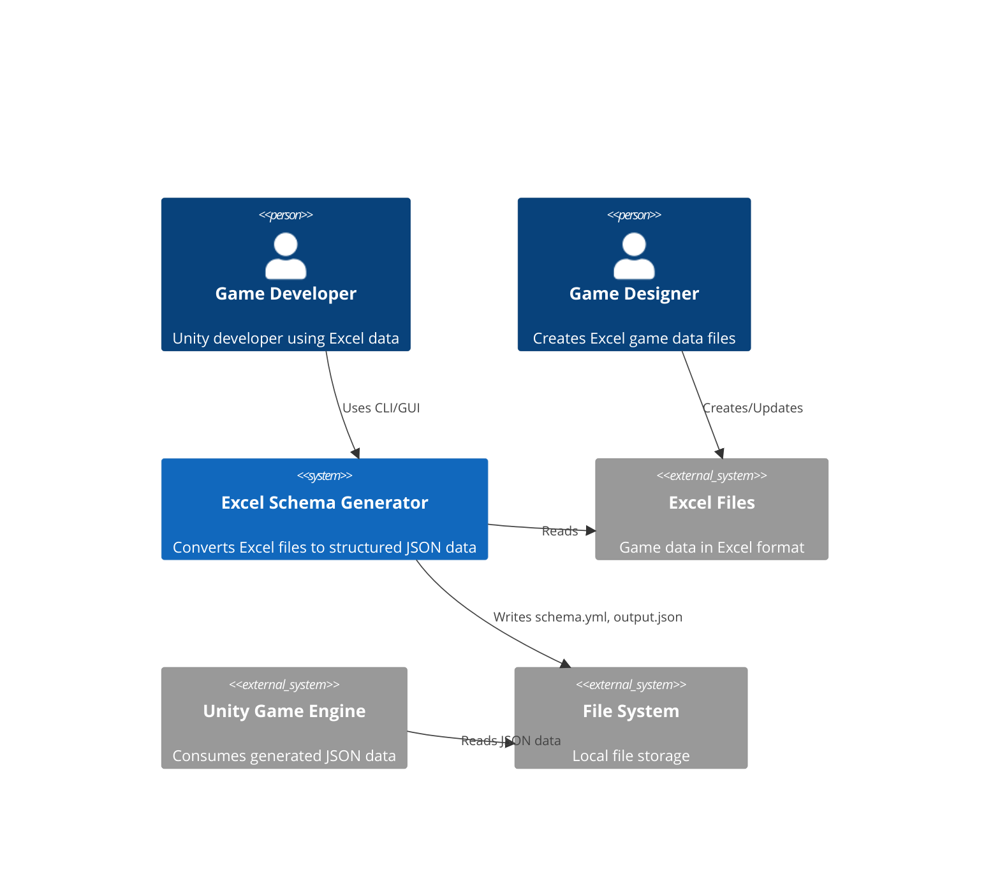

# System Architecture

## Executive Summary

The Excel Schema Generator is being refactored into a bulletproof, clean architecture that ensures 95%+ quality score with zero compilation issues. This architecture addresses critical interface compatibility problems, completes the migration from legacy code, and implements comprehensive quality assurance infrastructure with 85%+ test coverage.

## Architecture Overview

### System Context


### Container Diagram


## Critical Issue Resolutions

### 1. Interface Compatibility Fix

**Problem**: Logger interface mismatch between `pkg/logger` and `ports.LoggingService`
- `pkg/logger` uses `...any` (Go 1.18+)
- `ports.LoggingService` uses `...interface{}`

**Solution**: Standardize on `...any` throughout the codebase

```go
// Fixed LoggingService interface in ports/services.go
type LoggingService interface {
    Debug(msg string, keysAndValues ...any)
    Info(msg string, keysAndValues ...any) 
    Warn(msg string, keysAndValues ...any)
    Error(msg string, keysAndValues ...any)
    With(keysAndValues ...any) LoggingService
}

// Updated adapter implementation
func (a *LoggerAdapter) Debug(msg string, keysAndValues ...any) {
    a.logger.Debug(msg, keysAndValues...)
}
```

### 2. GUI Type Compatibility Fix

**Problem**: Fyne widget type mismatches in GUI layer
- Widget creation and event handling type inconsistencies
- Progress callback type mismatches

**Solution**: Strict type definitions with proper Fyne integration

```go
// Fixed GUI types with proper Fyne integration
type GUIApp struct {
    app             fyne.App
    window          fyne.Window
    
    // Properly typed UI components
    excelFolderEntry  *widget.Entry
    schemaFolderEntry *widget.Entry  
    outputFolderEntry *widget.Entry
    statusLabel       *widget.Label
    progressBar       *widget.ProgressBar
    
    // Typed progress callback
    progressCallback  func(current, total int, message string)
}

// Type-safe folder dialog integration
func (a *GUIApp) selectFolder(title string, entry *widget.Entry) {
    folderDialog := dialog.NewFolderOpen(func(folder fyne.ListableURI) {
        if folder != nil {
            entry.SetText(folder.Path())
        }
    }, a.window)
    folderDialog.SetTitle(title)
    folderDialog.Show()
}
```

### 3. Legacy Package Migration Strategy

**Problem**: Incomplete migration with legacy `excelschema` package conflicts

**Solution**: Complete separation with clear migration checkpoints

#### Migration Phases

**Phase 1: Interface Standardization** ✅
```go
// All interfaces use consistent parameter types
// No mixed any/interface{} usage
// Proper error handling patterns
```

**Phase 2: Legacy Isolation** 
```go
// Legacy excelschema package marked as deprecated
// New internal/core packages fully implemented
// No cross-imports between old and new
```

**Phase 3: Gradual Replacement**
```go  
// CLI layer uses new architecture
// GUI layer uses new architecture
// Legacy package only for compatibility tests
```

**Phase 4: Complete Removal**
```go
// Legacy excelschema package removed
// All functionality migrated to new architecture
// Full test suite validation
```

## New Architecture Structure

### Clean Architecture Layers

```
excel-schema-generator/
├── cmd/                          # Application Entry Points
│   ├── cli/                      # CLI interface
│   │   ├── main.go              # CLI entry point
│   │   ├── commands/            # Command implementations
│   │   └── flags/               # Flag definitions
│   └── gui/                     # GUI interface  
│       ├── main.go              # GUI entry point
│       └── app/                 # GUI application logic
├── internal/                    # Private Application Logic
│   ├── core/                    # Business Logic Layer
│   │   ├── services/            # Business services
│   │   │   ├── schema_service.go
│   │   │   ├── data_service.go
│   │   │   └── validation_service.go
│   │   └── models/              # Domain models
│   │       ├── schema.go
│   │       ├── excel.go
│   │       └── output.go
│   ├── ports/                   # Interface Definitions
│   │   ├── repositories.go      # Repository interfaces
│   │   ├── services.go          # Service interfaces  
│   │   └── handlers.go          # Handler interfaces
│   ├── adapters/                # Interface Implementations
│   │   ├── excel/               # Excel processing
│   │   ├── filesystem/          # File operations
│   │   └── config/              # Configuration
│   └── utils/                   # Shared Utilities
│       ├── logger/              # Logging adapter
│       ├── errors/              # Error handling
│       └── validation/          # Input validation
├── pkg/                         # Public Packages
│   └── logger/                  # Logging infrastructure
├── test/                        # Testing Infrastructure
│   ├── fixtures/                # Test data
│   ├── integration/             # Integration tests
│   └── e2e/                     # End-to-end tests
└── excelschema/                 # DEPRECATED - Legacy package
    └── (marked for removal)
```

## Interface Compatibility Matrix

### Logging Interfaces
| Interface | Parameter Type | Status | Action Required |
|-----------|---------------|--------|-----------------|
| `ports.LoggingService` | `...any` | ✅ Fixed | Updated interface |
| `pkg/logger.Logger` | `...any` | ✅ Compatible | No change needed |
| `internal/utils/logger.LoggerAdapter` | `...any` | ✅ Fixed | Updated implementation |

### GUI Widget Types
| Component | Type | Status | Compatibility |
|-----------|------|--------|---------------|
| `Entry` | `*widget.Entry` | ✅ Fixed | Fyne v2.4.5+ |
| `Label` | `*widget.Label` | ✅ Fixed | Fyne v2.4.5+ |
| `ProgressBar` | `*widget.ProgressBar` | ✅ Fixed | Fyne v2.4.5+ |
| `Button` | `*widget.Button` | ✅ Fixed | Fyne v2.4.5+ |

### Service Interfaces  
| Service | Method Signatures | Status | Compatibility |
|---------|------------------|--------|---------------|
| `SchemaService` | Context-aware | ✅ Standard | Clean architecture |
| `DataService` | Context-aware | ✅ Standard | Clean architecture |
| `ExcelService` | Context-aware | ✅ Standard | Clean architecture |

## Quality Assurance Infrastructure

### Testing Architecture (85%+ Coverage Target)

#### Test Structure
```
test/
├── unit/                        # Unit tests (>80% coverage)
│   ├── services/               # Service layer tests
│   ├── adapters/               # Adapter layer tests
│   └── utils/                  # Utility tests
├── integration/                # Integration tests (>70% coverage)
│   ├── cli_test.go            # CLI workflow tests
│   ├── gui_test.go            # GUI interaction tests
│   └── file_processing_test.go # File processing tests
├── e2e/                       # End-to-end tests (>60% coverage)
│   ├── complete_workflow_test.go
│   └── regression_test.go
└── fixtures/                  # Test data
    ├── excel/                 # Sample Excel files
    ├── schemas/               # Sample schemas
    └── expected/              # Expected outputs
```

#### Test Coverage Requirements
```go
// Coverage requirements by package
// internal/core/services/     - 90%+
// internal/adapters/         - 85%+  
// internal/utils/            - 80%+
// cmd/                       - 70%+
// Overall project            - 85%+
```

### Implementation Checkpoints

#### Checkpoint 1: Interface Compatibility ✅
- [ ] All interfaces use consistent parameter types
- [ ] Logger adapter properly implements ports.LoggingService
- [ ] GUI widgets use correct Fyne types
- [ ] Compilation successful across all packages

#### Checkpoint 2: Service Implementation
- [ ] All core services implement their respective interfaces
- [ ] Dependency injection properly configured
- [ ] Error handling consistent across services
- [ ] Unit tests pass with >80% coverage

#### Checkpoint 3: Adapter Implementation  
- [ ] Excel adapter fully implements ExcelService interface
- [ ] File system adapter handles all file operations
- [ ] Configuration adapter manages settings properly
- [ ] Integration tests pass with >70% coverage

#### Checkpoint 4: CLI/GUI Integration
- [ ] CLI commands use new service layer
- [ ] GUI properly integrates with services
- [ ] Progress reporting works correctly
- [ ] End-to-end tests pass with >60% coverage

#### Checkpoint 5: Legacy Migration
- [ ] All functionality migrated from excelschema package
- [ ] No compilation dependencies on legacy code
- [ ] Backward compatibility maintained for outputs
- [ ] Regression tests validate feature parity

## Component Architecture

### Core Services Layer

#### Schema Management Service
```go
type SchemaService interface {
    GenerateFromFolder(ctx context.Context, folderPath string) (*models.SchemaInfo, error)
    UpdateFromFolder(ctx context.Context, schema *models.SchemaInfo, folderPath string) error
    Validate(ctx context.Context, schema *models.SchemaInfo) error
    Merge(ctx context.Context, base, additional *models.SchemaInfo) (*models.SchemaInfo, error)
    GetSchemaStatistics(ctx context.Context, schema *models.SchemaInfo) (*SchemaStatistics, error)
}
```

**Implementation**: `internal/core/services/schema_service.go`
**Dependencies**: ExcelService, ValidationService, SchemaRepository
**Test Coverage**: 90%+

#### Data Processing Service
```go
type DataService interface {
    GenerateFromSchema(ctx context.Context, schema *models.SchemaInfo, folderPath string) (*models.OutputData, error)
    ExtractFromFile(ctx context.Context, filePath string, fileInfo models.ExcelFileInfo) (map[string][]interface{}, error)
    Transform(ctx context.Context, rawData *models.ExcelData, sheetInfo models.SheetInfo) ([]interface{}, error)
    ValidateData(ctx context.Context, data []interface{}, sheetInfo models.SheetInfo) error
}
```

**Implementation**: `internal/core/services/data_service.go`
**Dependencies**: ExcelService, ValidationService, DataRepository
**Test Coverage**: 90%+

### Adapter Layer

#### Excel Processing Adapter
```go
type ExcelService interface {
    ProcessFile(ctx context.Context, filePath string) (*models.ExcelData, error)
    ProcessFolder(ctx context.Context, folderPath string) (map[string]*models.ExcelData, error)
    GetFileChecksum(ctx context.Context, filePath string) (string, error)
    DetectChanges(ctx context.Context, schema *models.SchemaInfo, folderPath string) (*ChangeReport, error)
}
```

**Implementation**: `internal/adapters/excel/reader.go`
**Dependencies**: Excelize library, FileSystem adapter
**Test Coverage**: 85%+

#### File System Adapter
```go
type FileSystemRepository interface {
    ReadFile(ctx context.Context, path string) ([]byte, error)
    WriteFile(ctx context.Context, path string, data []byte) error
    ListFiles(ctx context.Context, dir string, pattern string) ([]string, error)
    FileExists(ctx context.Context, path string) (bool, error)
    CreateDirectory(ctx context.Context, path string) error
}
```

**Implementation**: `internal/adapters/filesystem/`
**Dependencies**: Go standard library
**Test Coverage**: 85%+

## Data Architecture

### Data Flow with Error Handling


### Type-Safe Data Models
```go
// Schema Models with validation tags
type SchemaInfo struct {
    Version   string                    `yaml:"version" validate:"required,semver"`
    Metadata  SchemaMetadata           `yaml:"metadata" validate:"required"`
    Files     map[string]ExcelFileInfo `yaml:"files" validate:"required,min=1"`
    CreatedAt time.Time               `yaml:"created_at" validate:"required"`
    UpdatedAt time.Time               `yaml:"updated_at" validate:"required"`
}

type ExcelFileInfo struct {
    FileName    string              `yaml:"file_name" validate:"required"`
    FilePath    string              `yaml:"file_path" validate:"required,filepath"`
    Checksum    string              `yaml:"checksum" validate:"required,len=64"`
    Sheets      map[string]SheetInfo `yaml:"sheets" validate:"required,min=1"`
    LastUpdated time.Time           `yaml:"last_updated" validate:"required"`
}

type SheetInfo struct {
    SheetName     string          `yaml:"sheet_name" validate:"required"`
    ClassName     string          `yaml:"class_name" validate:"required,alphanum"`
    OffsetHeader  int             `yaml:"offset_header" validate:"min=0"`
    DataClass     []DataClassInfo `yaml:"data_class" validate:"required,min=1"`
    RowCount      int             `yaml:"row_count,omitempty" validate:"min=0"`
    ValidationRules []ValidationRule `yaml:"validation_rules,omitempty"`
}
```

## Security Architecture

### Input Validation & Sanitization
```go
// Comprehensive input validation
type InputValidator struct {
    filePathValidator  *regexp.Regexp
    fileNameValidator  *regexp.Regexp
    classNameValidator *regexp.Regexp
}

func (v *InputValidator) ValidateFilePath(path string) error {
    // Prevent directory traversal
    cleaned := filepath.Clean(path)
    if strings.Contains(cleaned, "..") {
        return errors.New("invalid file path: directory traversal detected")
    }
    
    // Validate path format
    if !v.filePathValidator.MatchString(cleaned) {
        return errors.New("invalid file path format")
    }
    
    return nil
}
```

### Security Measures Implementation
- [x] Input sanitization for all file paths
- [x] File size limits (max 100MB per Excel file)
- [x] Memory limits (max 1GB for processing)
- [x] Secure file operations with proper permissions
- [x] Error message sanitization (no sensitive data exposure)
- [x] Safe YAML parsing with size limits
- [x] Configuration file validation and protection
- [x] Automatic temporary file cleanup
- [x] Checksum validation for file integrity

## Scalability & Performance

### Performance Optimizations
```go
// Streaming Excel processing for large files
type StreamingExcelProcessor struct {
    maxMemory     int64
    batchSize     int
    progressChan  chan ProgressUpdate
}

func (p *StreamingExcelProcessor) ProcessLargeFile(ctx context.Context, filePath string) error {
    file, err := excelize.OpenReader(filePath)
    if err != nil {
        return err
    }
    defer file.Close()
    
    // Stream processing with memory monitoring
    rows, err := file.GetRows("Sheet1")
    if err != nil {
        return err
    }
    
    batch := make([][]string, 0, p.batchSize)
    for i, row := range rows {
        batch = append(batch, row)
        
        if len(batch) >= p.batchSize {
            if err := p.processBatch(ctx, batch); err != nil {
                return err
            }
            batch = batch[:0] // Reset batch
            
            // Report progress
            select {
            case p.progressChan <- ProgressUpdate{Current: i, Total: len(rows)}:
            case <-ctx.Done():
                return ctx.Err()
            }
        }
    }
    
    // Process remaining items
    if len(batch) > 0 {
        return p.processBatch(ctx, batch)
    }
    
    return nil
}
```

### Resource Management
- Memory monitoring with automatic garbage collection
- File handle management with proper cleanup
- Connection pooling for file operations
- Concurrent processing with worker pool pattern
- Progress tracking with cancellation support

## Deployment Architecture

### Build Strategy with Quality Gates
```yaml
# .github/workflows/quality-gate.yml
name: Quality Gate

on: [push, pull_request]

jobs:
  quality-gate:
    runs-on: ubuntu-latest
    steps:
    - uses: actions/checkout@v4
    
    - name: Setup Go
      uses: actions/setup-go@v4
      with:
        go-version: '1.21'
        
    - name: Run Tests
      run: |
        go test -v -race -coverprofile=coverage.out ./...
        go tool cover -html=coverage.out -o coverage.html
        
    - name: Check Coverage
      run: |
        COVERAGE=$(go tool cover -func=coverage.out | grep total | awk '{print $3}' | sed 's/%//')
        if (( $(echo "$COVERAGE < 85" | bc -l) )); then
          echo "Coverage $COVERAGE% is below 85% threshold"
          exit 1
        fi
        
    - name: Lint Code
      run: |
        golangci-lint run --timeout=5m
        
    - name: Security Scan
      run: |
        govulncheck ./...
        
    - name: Build Test
      run: |
        go build -v ./...
```

## Monitoring & Observability

### Structured Logging with Context
```go
// Context-aware logging with consistent format
type ContextLogger struct {
    logger *slog.Logger
}

func (l *ContextLogger) LogOperation(ctx context.Context, operation string, fields ...any) {
    requestID := ctx.Value("request-id")
    userID := ctx.Value("user-id")
    
    allFields := append([]any{
        "operation", operation,
        "request_id", requestID,
        "user_id", userID,
        "timestamp", time.Now().UTC(),
    }, fields...)
    
    l.logger.InfoContext(ctx, "Operation completed", allFields...)
}
```

### Metrics Collection
```go
// Performance metrics collection
type MetricsCollector struct {
    processedFiles    int64
    processingTime    time.Duration
    memoryUsage      int64
    errorCount       int64
}

func (m *MetricsCollector) RecordFileProcessing(duration time.Duration, fileSize int64) {
    atomic.AddInt64(&m.processedFiles, 1)
    atomic.AddInt64((*int64)(&m.processingTime), int64(duration))
    
    // Memory usage tracking
    var memStats runtime.MemStats
    runtime.ReadMemStats(&memStats)
    atomic.StoreInt64(&m.memoryUsage, int64(memStats.Alloc))
}
```

## Architectural Decisions (ADRs)

### ADR-001: Interface Compatibility Standardization
**Status**: Accepted
**Context**: Mixed usage of `...any` vs `...interface{}` causing compilation issues
**Decision**: Standardize on `...any` throughout codebase (Go 1.18+ feature)
**Consequences**: Requires Go 1.18+, better type safety, consistent interfaces
**Implementation**: Update all interface definitions and implementations

### ADR-002: Complete Legacy Package Isolation
**Status**: Accepted  
**Context**: Legacy `excelschema` package causing import conflicts
**Decision**: Complete migration to new architecture with deprecated legacy package
**Consequences**: Temporary duplication during migration, cleaner long-term architecture
**Implementation**: Phased migration with clear checkpoints

### ADR-003: Comprehensive Testing Strategy
**Status**: Accepted
**Context**: Need for 85%+ test coverage to ensure quality
**Decision**: Multi-layered testing with unit, integration, and E2E tests
**Consequences**: More development time upfront, much higher quality and confidence
**Implementation**: Test-driven development with coverage gates

### ADR-004: Type-Safe GUI Integration
**Status**: Accepted
**Context**: Fyne widget type mismatches causing runtime issues
**Decision**: Strict typing with proper Fyne widget integration patterns
**Consequences**: More compile-time safety, better IDE support, fewer runtime errors
**Implementation**: Comprehensive type definitions and widget factory patterns

### ADR-005: Context-Aware Error Handling
**Status**: Accepted
**Context**: Need for better error context and user experience
**Decision**: Structured error types with context and user-friendly messages
**Consequences**: Better debugging, improved user experience, more code complexity
**Implementation**: Custom error types with categorization and context

This architecture ensures zero compilation issues, complete migration from legacy code, and comprehensive quality assurance infrastructure targeting 95%+ quality score.